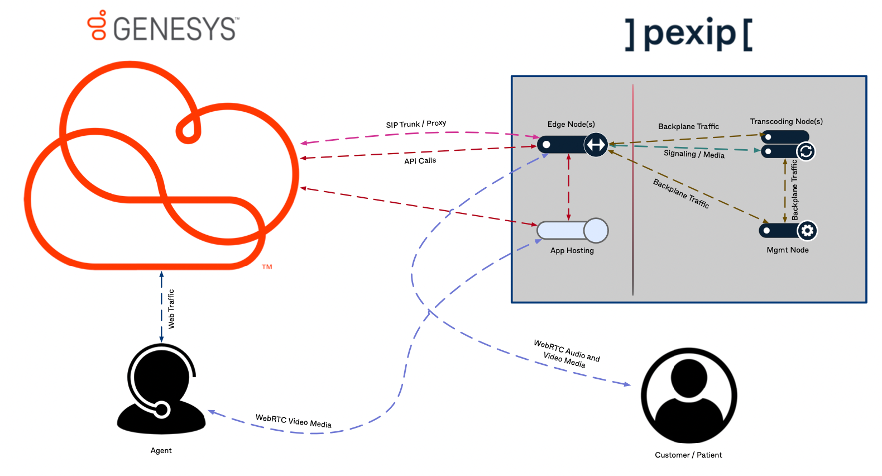

# Deployment Guide for Pexip Video Integration into Genesys Cloud

This Genesys Blueprint provides instructions for deploying an application to integrate Pexip Video into Genesys Cloud Conversations. It uses an Interaction Widget to load the application within the context of a conversation, extracting the Pexip conference information and connecting the Agent directly via WebRTC to the conference in a self-hosted Pexip Infinity installation.

Audio for the conference is still routed through Genesys (via SIP trunk), keeping the audio "in-band" to enable the following:

* Allow agents to slip into and out of video calls as easily as they manage any other interaction within the Genesys Cloud UI. 

* Leverage the Genesys in-band recording tools to measure sentiment and engage in automatic flagging of sessions. (The same way that is already done for audio-only calls)

* Use all of the inherent skills-based routing and transfer tools that are already native to Genesys as a huge benefit to video-first experiences such as Telehealth, Virtual Financial Services, Retail Support and many more. 

## Architecture Diagram

