This Genesys Blueprint provides instructions for deploying an application to integrate Pexip Video into Genesys Cloud Conversations. It uses an Interaction Widget to load the application within the context of a conversation, extracting the Pexip conference information and connecting the Agent directly via WebRTC to the conference in a self-hosted Pexip Infinity installation.

Audio for the conference is still routed through Genesys (via SIP trunk), keeping the audio "in-band" to enable the following:

* Allow agents to slip into and out of video calls as easily as they manage any other interaction within the Genesys Cloud UI. 

* Leverage the Genesys in-band recording tools to measure sentiment and engage in automatic flagging of sessions. (The same way that is already done for audio-only calls)

* Use all of the inherent skills-based routing and transfer tools that are already native to Genesys as a huge benefit to video-first experiences such as Telehealth, Virtual Financial Services, Retail Support and many more. 

## Architecture Diagram


## Solution components
* **Genesys Cloud** - The Genesys cloud-based contact center platform. Genesys Cloud is the platform into which Pexip Video integrates.
* **Genesys AppFoundry** - The Genesys AppFoundry is an app marketplace for solutions that run on the Genesys Cloud platform. You get the Pexip Video integration used in the solution from the Genesys AppFoundry.
* **Pexip Infinity** - Pexip Infinity is a self-hosted video communications platform. For this solution, it is used to manage the video conference media streams between the customer and Genesys Cloud.

### Software Development Kit (SDK)
* **Genesys Cloud Platfrom API SDK** - This SDK is used for the managing the conversation workflow, extracting information about the conversation necessary to initiate the Pexip video session and then monitoring for events that signal the end of a conversation.
* **PexRTC JavaScript client API** - The Pexip WebRTC SDK. It is used to answer and disconnect video sessions from within the Genesys Cloud environment. Review the [PexRTC JavaScript client API documentation](https://docs.pexip.com/api_client/api_pexrtc.htm) for more information.

## Requirements

### Specialized knowledge
Implementing this solution requires experience in several areas or a willingness to learn:

* Administrator-level knowledge of Genesys Cloud and the Genesys AppFoundry
* Adminstrator-level knowledge of Pexip Infinity
* Genesys Cloud Platform API knowledge
* Familiarity with the [PexRTC JavaScript client API](https://docs.pexip.com/api_client/api_pexrtc.htm)

### Genesys Cloud account requirements
This solution requires a Genesys Cloud license. For more information on licensing, see [Genesys Cloud Pricing](https://www.genesys.com/pricing "Opens the pricing article").

A recommended Genesys Cloud role for the solutions engineer is Master Admin. For more information on Genesys Cloud roles and permissions, see the [Roles and permissions overview](https://help.mypurecloud.com/?p=24360 "Opens the Roles and permissions overview article").

### Pexip Infinity requirements
This solution requires a Pexip Infinity Self-hosted environment. For licensing information or to schedule a demo, please visit the [Pexip Self-hosted software](https://www.pexip.com/self-hosted "Opens the Pexip Self-hosted software information site") site.

If you already have a license, please reach out to your TAM or visit the [Pexip Infinity installation guidelines](https://docs.pexip.com/admin/site_installation.htm "Open Pexip Infinity installation guidelines") for guidance on installing Pexip Infinity. 

Administative access to the Pexip Infinity environment is required. Please see the [Pexip Infinity Administration Documentation](https://docs.pexip.com/admin/site_administration.htm "Open Pexip Infinity Administration Site") for more information.

## Workflow

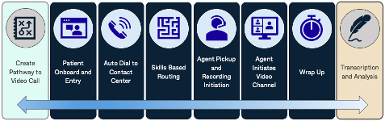

#### 1. Create Pathway to Video Call
This step will be custom for each organization, based on requirements for initiating the user/patient session: simple form, click-to-call, existing chat session, etc. Regardless of the method, a unique link will be generated for this session. See the [sample customer-app](https://github.com/pexip/pexip-genesys-agent-blueprint/blob/main/customer-app/index.html#L34) for an example of how this URL should be formatted.

#### 2. User Onboard and Entry
Customer lands on video page. Here the customer will authorize the WebRTC tools to access camera and microphone peripherals. There are some options here depending on what works best for the user profile.

#### 3. Auto Dial to Contact Center
Once in the video session, the customer will see their camera and be able to hear audio. After a few moments, the room will automatically dial out to the Genesys phone number associated with the SIP trunk that was established.

#### 4. Skills Based Routing
This phone call will route to a Genesys Call Flow. This flow can be configured based upon the customer’s needs – but ultimately will be tied to Agents with a specific skills profile.
 
#### 5. Agent Pickup and Auto Recording
Call will ring on the native Genesys soft phone. The SIP trunk associated with this inbound call will be configured to auto-record upon initiation. Agent can simply answer the call on audio as they normally would.

#### 6. Agent Initiates Video Channel 
While audio call is going, agent will be able to easily join via video only. This video join will actually be an additional participant but will have the microphone and speaker audio disabled by default. (Video Stream Only). This is the integration included in this repo, under the [agent-app](https://github.com/pexip/pexip-genesys-agent-blueprint/tree/main/agent-app) directory.

#### 7. Wrap Up 
Agent hangs up and uses appropriate wrap-up code.

#### 8. Transcription and Analysis
Genesys handles the transcription, sentiment analysis, and storage of the audio stream from the conversation.


## Pre-deployment Tasks

The following tasks, some in Genesys and some in Pexip, are required prior to deploying this blueprint to your Genesys account. Please reach out to your Pexip TAM with any questions or to request assistance.

### Purchase Phone Number [Genesys]

* This is the number that will be used when you create the SIP Trunk.

    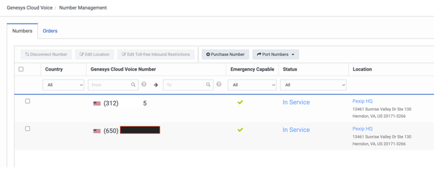

### Create SIP Trunk [Genesys]

* Use TCP 5061, to enforce encrypted traffic between Pexip and the Genesys SIP Trunk. Make a note of the inbound SIP URI. It will be used when updating the Pexip Infinity local policy.

    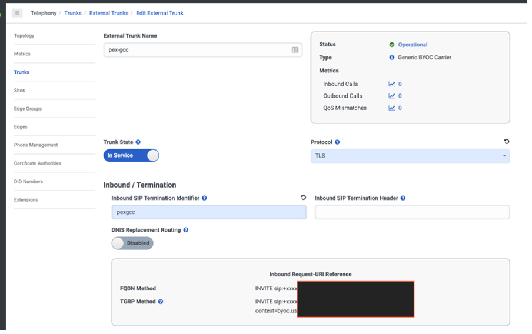
   
### Create Call Queue [Genesys]

* Select the inbound phone number created above and enable transcription on the queue, if necessary.

    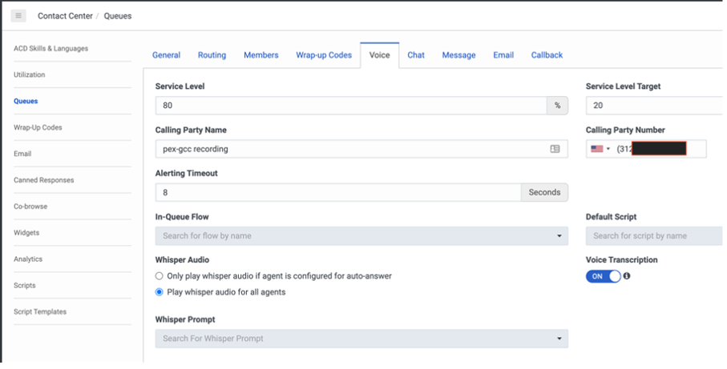


### Create Call Flow [Genesys]

* Design the call flow to meet business needs, routing to the call queue created above and enabling transcription on the flow, if necessary.

    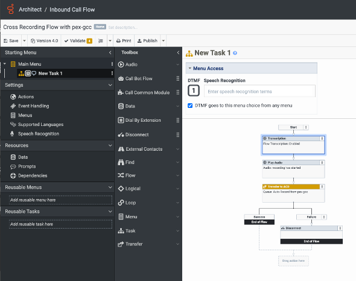

### Create SIP Proxy for Genesys Trunk created above [Pexip Infinity]

* Go to Call Control → SIP Proxies. Use the FQDN for the SIP Trunk created in Genesys.

    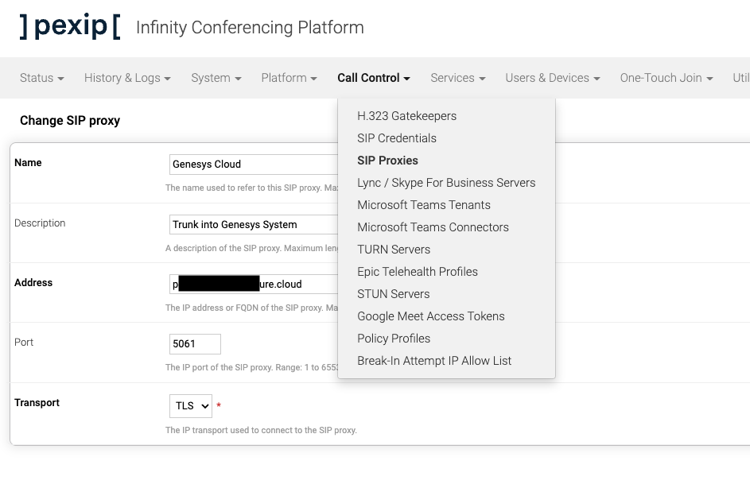

### Create Routing Rule for Genesys Phone Number [Pexip Infinity]

* This will translate the number stored in local policy into the Genesys Inbound SIP URI.

    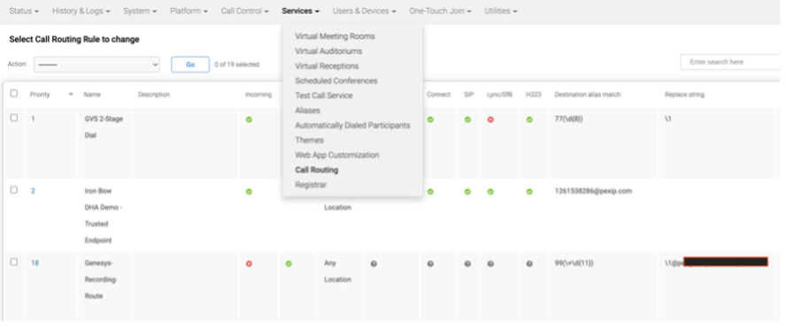
    
### Create Local Policy to Allow Ad-hoc Meetings [Pexip Infinity]

* This defines how calls initiated as illustrated in `customer-app` will trigger creation of a VMR and make a call to Genesys to pull in an Agent. Please reach out to your Pexip TAM for assistance in composing this policy.

    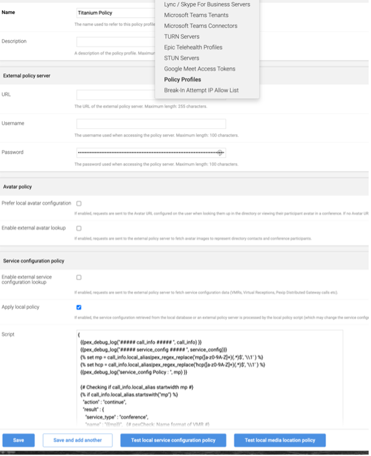
    
### Create Custom Theme for Video Conference [Pexip Infinity]

* Please see [Pexip custom theme documentation](https://docs.pexip.com/admin/themes.htm) for more information.

    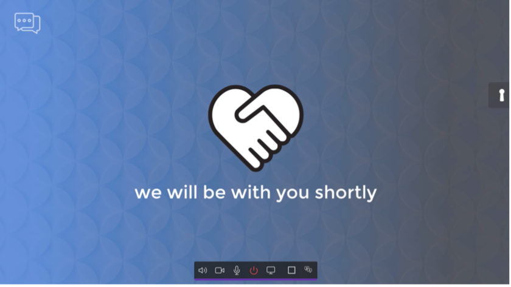

## Deployment Steps

The Pexip Agent Video integration has the following stages:

* Clone the repository containing the project files (GitHub)
* Create a Token Implicit OAuth Grant for Genesys Cloud (Genesys)
* Serve Agent App and (optionally) Customer App files
* Setup an Interaction Widget integration in Genesys Cloud (Genesys)
* Make a Test Call

### Clone the repository containing the project files

1. Clone this repository to your local machine: `git clone git@github.com:pexip/pexip-genesys-agent-blueprint.git`

### Create a Token Implicit OAuth Grant for Genesys Cloud

1. Login to your Genesys Cloud organization and create a new OAuth API (Token Implicit Grant). [Create an OAuth Client](https://help.mypurecloud.com/articles/create-an-oauth-client/)
2. Assign your hosted site to the Authorized redirect URIs. If testing using the Local Test Server (see below), make sure to include `http://localhost:8080`.
3. Save your Client Id for configuration in the next step.

### Serve Agent App and (optionally) Customer App files

#### Application configuration
Update the Genesys and Pexip settings in [agent-app/scripts/config.js](../agent-app/scripts/config.js), as well as the `prodUri` if you know where you'll be hosting the Agent App files in production.

#### Local test server

1. Open a terminal in the project directory and install the dependencies in the local node-modules folder.

    ```
    npm install
    ```

2. Run the server by entering this in the terminal

    ```
    npm run server
    ```

3. You can access the test Agent App at [http://localhost:8080](http://localhost:8080) and the test Customer App at [http://localhost:8081](http://localhost:8081).

#### Production
Once ready to proceed to production, the files in `agent-app` and `customer-app` can be hosted behind any static web server.

### Setup an Interaction Widget integration in Genesys Cloud
1. Login to your Genesys Cloud organization and add a new **Integration**.

    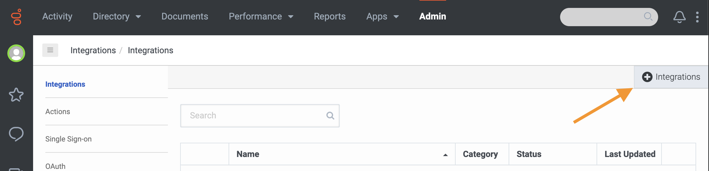
   
2. Install the **Interaction Widget**.

    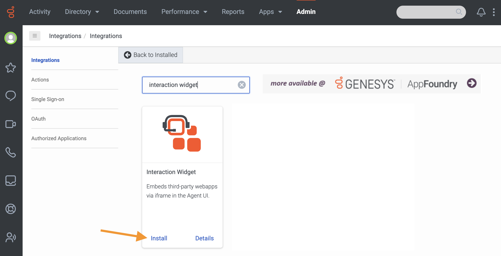
   
3. Provide a name for the integration. It must be unique amongst the other integrations in your account.

    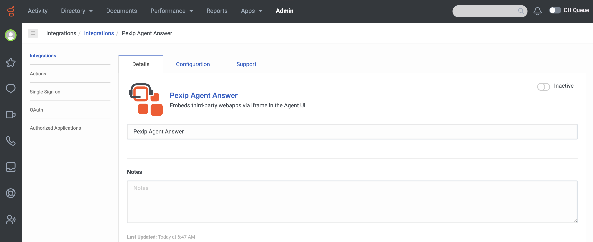
   
4. Click the **Configuration** tab and set the following properties.

    **Application URL**

    Set to either the local development server or to the publicly hosted domain if you've already deployed the Agent App. Append the query string `?conversationid={{pcConversationId}}` to the end of the URL, which is used by the Agent App to query for information needed to connect to the Pexip Video session.

    ```
    http://localhost:8080?conversationid={{pcConversationId}}
    ```

    ```
    https://pexip-agent-app.example.com/path/to/app?conversationid={{pcConversationId}}
    ```

    **Iframe Sandbox Options**

    ```
    allow-scripts,allow-same-origin,allow-forms,allow-modals
    ```

    **Iframe Feature/Permissions Policy**

    ```
    camera, microphone
    ```
    
    **Group Filtering and Queue Filtering**
    
    Optionally, you can set filtering on the integration to limit to access to particular groups or queues.

    **Communication Type Filtering**

    ```
    call
    ```

   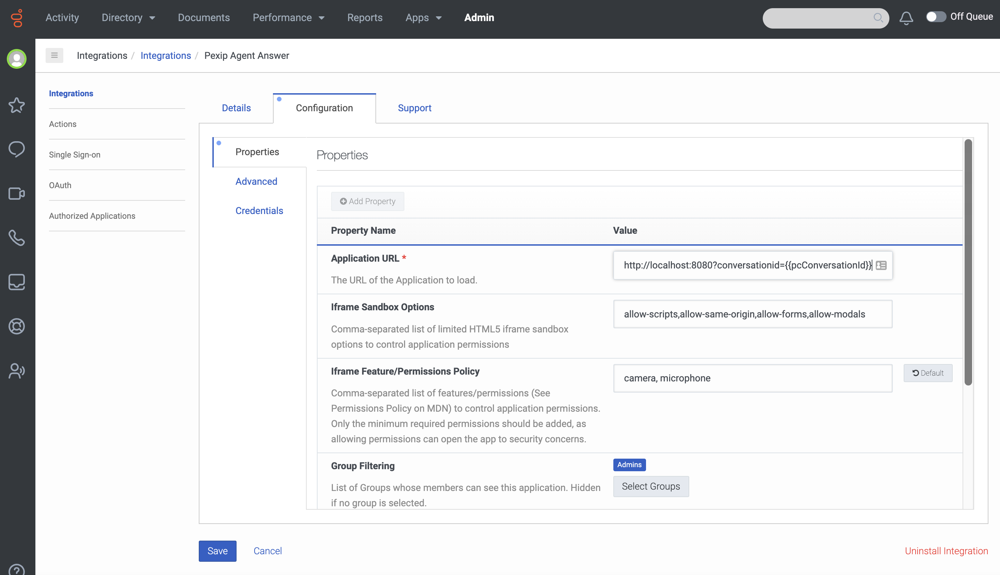
   
5. Go to **Advanced** Configuration and enter this in the text area:

   ```json
   {
     "lifecycle": {
       "ephemeral": false,
       "hooks": {
         "stop": true,
         "blur": false,
         "focus": false,
         "bootstrap": false
       }
     },
     "monochromicIcon": {
       "vector": "https://pexip.github.io/pexip-genesys-agent-blueprint/agent-app/images/pexip-icon.svg"
     }
   }
   ```

6. **Save** and **Activate** the integration.

    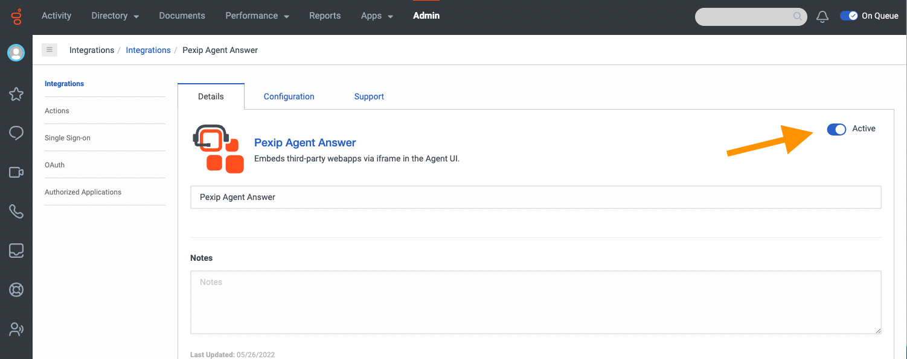

### Make a Test Call

1. Log in to Genesys: [https://login.mypurecloud.com/](https://login.mypurecloud.com/).
2. Switch your user to "On Queue"
3. Open the Test Customer App: [http://localhost:8081](http://localhost:8081). Click the "Initiate Test Session" button.
4. Answer the call in Genesys (it will take 10-15 seconds to ring).

    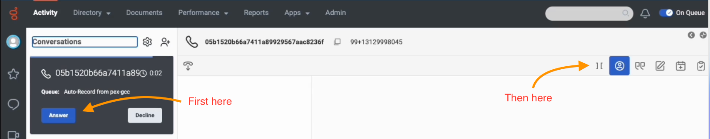
    
### Demo

https://user-images.githubusercontent.com/35565/176011688-05685907-c056-4a17-8788-e0342dd05768.mp4

## Additional Resources
* [Genesys Cloud Developer Center](https://developer.mypurecloud.com/)
* [Genesys Cloud Platform Client SDK](https://developer.mypurecloud.com/api/rest/client-libraries/)
* [Pexip Developer Portal](https://developer.pexip.com/)
* [Pexip Infinity](https://www.pexip.com/self-hosted "Opens the Pexip Self-hosted software information site")
* [PexRTC JavaScript client API](https://docs.pexip.com/api_client/api_pexrtc.htm)
